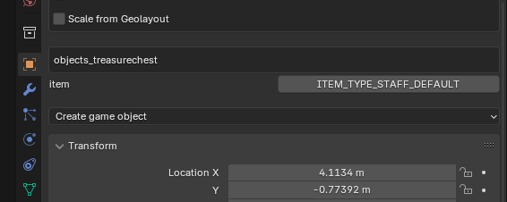
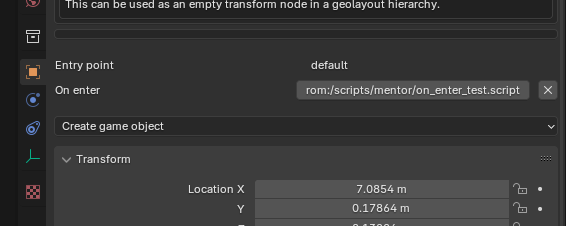
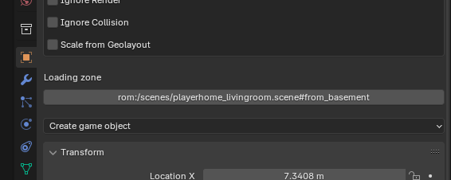

# Asset Management

3D Models and enviroments are built in blender. The build pipeline uses an export script to transform these assets into
in game assets. Any blend file in the `assets/meshes` folder will be turned into a mesh loadable in the game. Any blend
file in the `assets/scenes` become a loadable scene.

## Images

Images are in the `assets/images` folder and must be a png file. The export script will attempt to figure out the image
file format automatically. For example, if the image uses palette the image will use a palette in game. The two formats
that will not likely auto detect correctly are I4 and RGBA32. If you need those file formats, put a json in the same
folder as the image with the same name but with the extension `.json` instead of `.json` that manually specifies the
format

```json
{
    "format": "I4"
}
```

## Materials

Materials can be defined one of two ways. Either using a custom json format that still needs to documented. Look in the 
`assets/materials` folder to see examples of the `.mat.json` format. After making the mat file run 
`make assets/materials/materials.blend` to convert the materails into a blend material that can be linked from the
blend files for meshes and environments.

Materials can also be defined by using [fast64](https://github.com/Fast-64/fast64). Any mesh that uses fast64 materials
will automatically generate materials without needing a `.mat.json` file. Images in these materials must link to an
image in the `assets/images` folder.

Materials that should be reused between meshes should be added to the `assets/materials/material_source.blend` blend 
file. That material's name must start with `materials/`. That material can then be linked into other meshes and scenes. 

If a material is unique to a mesh or scene, there is no need to use the material_source file.

## Meshes

Meshes can have many materials, but if there is an armature there must be only a single armature. Animations should be
implemented using armatures instead of animating the object nodes.

Armature attachment points can be used to connect other objects to a bone in an armature. This can be used for example
to put objects in the hands of the player or hats and masks on the head. To do this, link the mesh
from another file and make a bone the parent of an object using the linked mesh. The linked object wont be included
in the mesh. Instead a link point will be generated that can be used to attach objects later. A single link point
can attach any object, not just the one used to create the link point.

Animations should be done as actions for the single armature. The animation should be generic such as "walk" or "attack"
and not include names of the object being animated.

## Scenes

Any mesh in a scene that has materials will be rendered in the loaded game with some exceptions detailed further down.
To add collision to a mesh, goto the physics tab after selecting a mesh object and add a rigid body. Then in the rigid
body section change the collision shape to mesh. An object can both have materials to render and have a mesh collider.
If you want a mesh to only have a collider, then remove all materials for the mesh.

### Entry Points

If a game object's name start with `entry#` it will be considered an entry point into a scene.
The entry point named `default` will be used if no other entry point is specified.

### Loading Zones

If you mark a cube with a custom string property named `loading_zone` the space the box covers will become a loading
zone that when the player enters will trigger loading the scene it points to. The scene starts with 
`rom:/scenes/` followed by the blend file name of a scene, such as `playerhome_outside` with the new extension of
`.scene`. You can specify which entry point to use by adding it with a `#` then the name of the entry point, such as 
`#main_entrance`. All together this would look like `rom:/scenes/playerhome_outside.scene#main_entrance`. 

### Entities

Entity types are defined in `src/scene/scene_definition.h` by creating a struct with a name that ends in `_definition`
The scene exporter looks at the structure of definiton and populates it with information from the blend file.
`position` must be a `struct Vector3` and will hold the position of the object in the scene. `rotation` can either be a
`struct Vector2` or a `struct Quaternion`. A Quaternion can hold any orientation while a Vector2 can only store yaw.
You can add any named string (`char*`), float, or integer to the definition and the export script will look for a
custom property on the blend object or blend mesh to populate when exporting. You can also define an enum in
`src/scene/scene_definition.h` and specify the value of a custom property as an enum value.

To choose what entity type an object is, you need to add a custom property named `type` where the value is the name of
a struct in `src/scene/scene_definition.h` without `_definition`. So for example the custom property of `type` with value
`treasure_chest` will include the object as a tressure check regaurdless of what the mesh actually looks like.

To make including these objects easier, you can add a custom property to the mesh of an object then link that mesh into
scene files. For example, the mesh at `assets/meshes/objects/treasurechest.blend` which is used to render the treasure 
check object has a property named `type` on the mesh with the value `treasure_chest`. That same mesh can be linked into
scene files. Just by linking the mesh, the object will be made into an interactable mesh object and not as static geometry. 
The position and rotation of the chest will automatically be transferred to the definition. To choose what item
the treasure chest gives, you can add an additional custom stringproperty to the object inside the scene called `item`. 
The value should one of the names from the `enum inventory_item_type` such as `SPELL_SYMBOL_FIRE` or `ITEM_TYPE_STAFF_DEFAULT`.

By having custom properties that don't change for an object type on the mesh, it makes it easy to link these dynamic
objects into scenes and lets blender operate somewhat as a scene editor.

## Level Editor

The folder `tools/mesh_export` can be used as a blender plugin. To use it, zip the folder then install it blender by selecting `Edit -> Preferences` then choose `Add-ons -> Install from Disk` and choose the zip file. 

This will add a few tools in the objects tab. You can edit game object's properties, for example, the treasure chest object will let you choose which item it contains.



If you select an entry point you can add an `on entry` script that is run when the player enters through this entry point.



If you select a loading zone, you can select which entry point it points to



Quick linking of materials. If you goto `File -> Quick link material` you can select a material in the material folder to link to this blend file for use in the model. It only works with materials defined in `.mat.blend` files. You can use the quick action menu by pressing spacebar(blender 2.7) F3(later blender bindings) and typing `quick link material`.

You can also add game objects by either clicking the `Create game object` button in the objects panel or by searching for the object you want to add in the quick actions menu (spacebar or F3). This will add the game object where the current is currently located