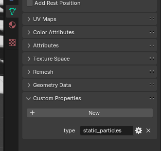
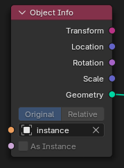
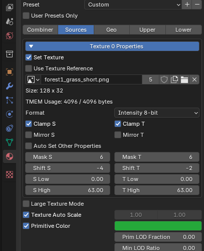

# Static particles

static particles are drawn as textures (or solid colors) facing the camera. They are pretty fast to draw so including a large
 number of them should be pretty performant. 

To render a mesh as a bunch of particles you need to take the following step.

* Add a custom string property to the mesh you want to render as particles named `type` with the value `static_particles`
* Add a single material to the mesh. Set this material to control how the mesh renders in the game engine
* Add a color attribute channel named `Col`
* Add a vertex group called `Size`
* Finally add a geometry node modifier with a node of type `Object info`. Set the object to be the mesh you want to intantiate. This mesh must have a custom property named `type` with the value of `none`. The size of the instance in the y direction will control the height of the particle and x the width.

This setup can be skipped by just copying the file `assets/particles/grass_particles.blend` and modifying it.

The change you will likely want to make include.

* Change the size of the instance mesh
* Change the material of the instance mesh (this effects the material in blender but not the engine)
* Change the material of the particles mesh (this effects the material in game but not in blender)

Each particles blend file can serve as a template that you then append to a scene file when you want to place particles.

At this point you can edit the vertices of the particles mesh to add or move the particles around. The vertex color for the particle will
effect the vertex color in blender but becomes the PRIM color in game. This is why there needs to be a preview and a in game material
and they can't just use the same material.

You can use the `Size` vertex group to control how big the particle is. A value of 1 will be full size anything smaller will scale the particle down.

The texture coordinate on a particle map to an 8x8 texture. You can use a power of 2 texture larger than 8 you just need to uncheck `Auto Set Other Properties` in the `Source` section in the f64 material editor and adjust the `Shift` value to
compensate for the texture size. If the size is 8px, you keep it at 0. If the texture is 16, then you set it to -1. 32 needs -2. 64 needs -3. 128 needs -4.

